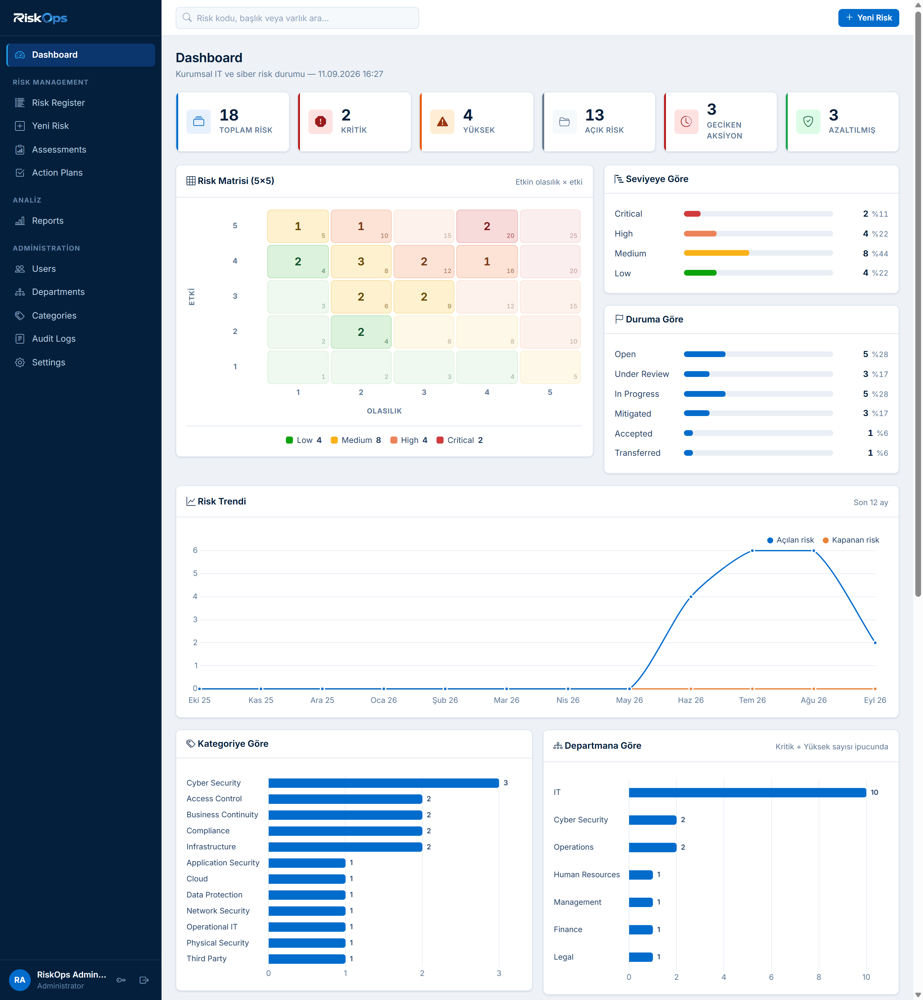
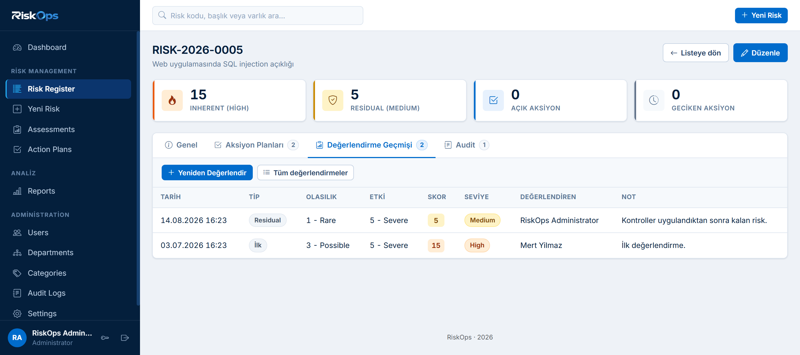
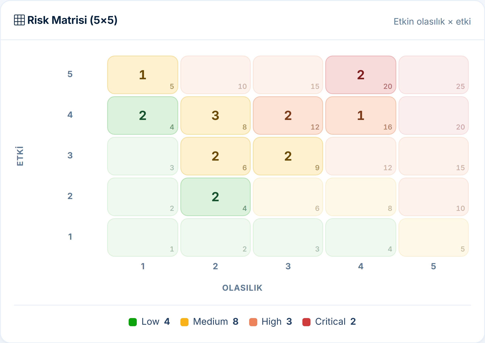
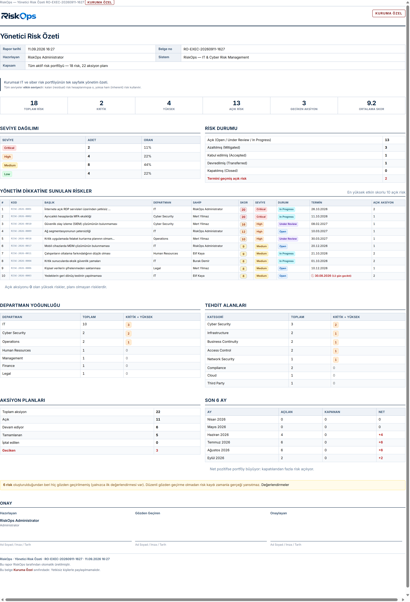
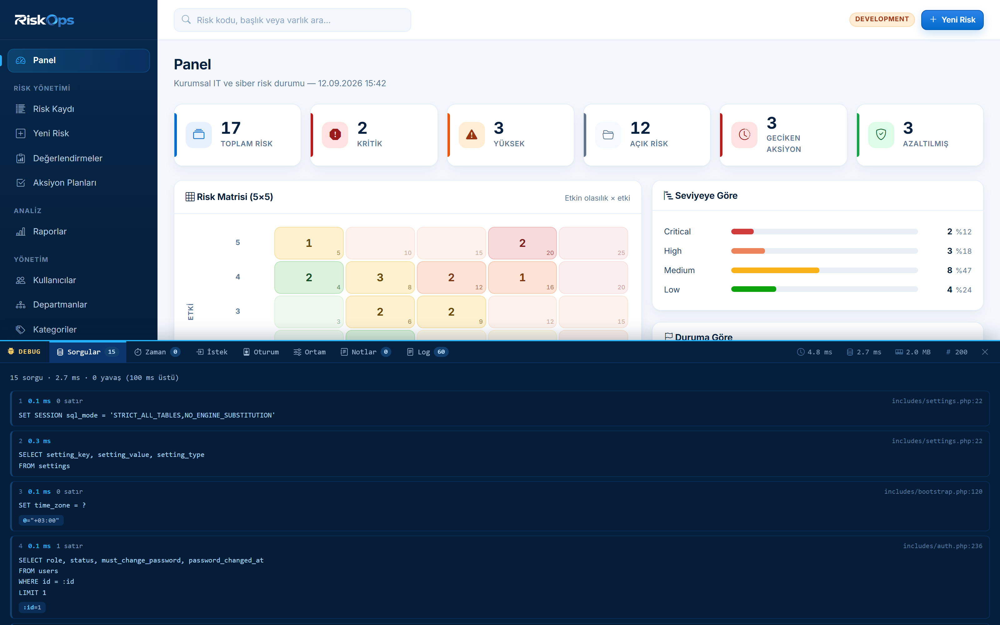
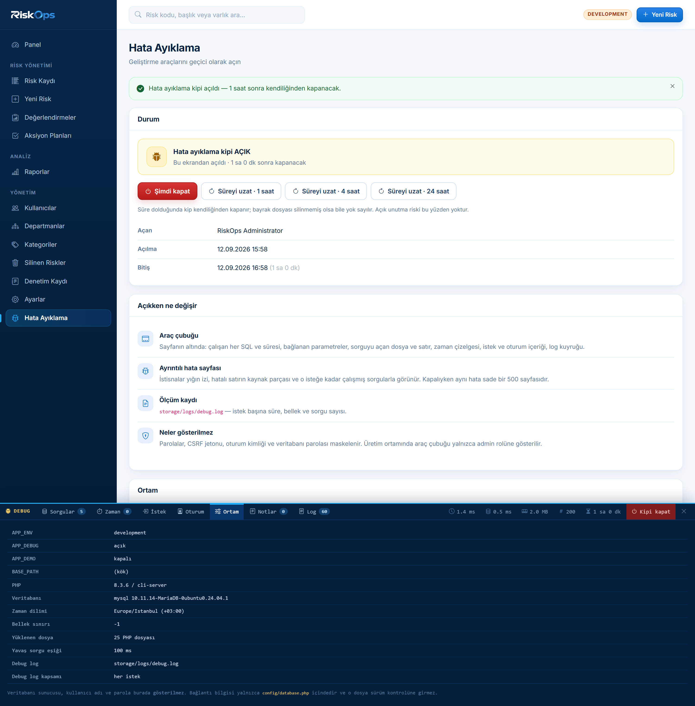
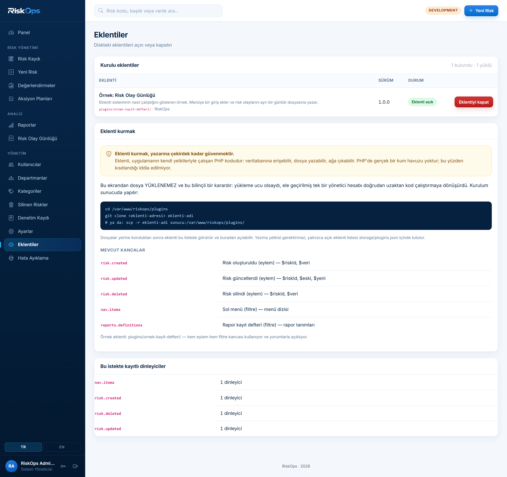
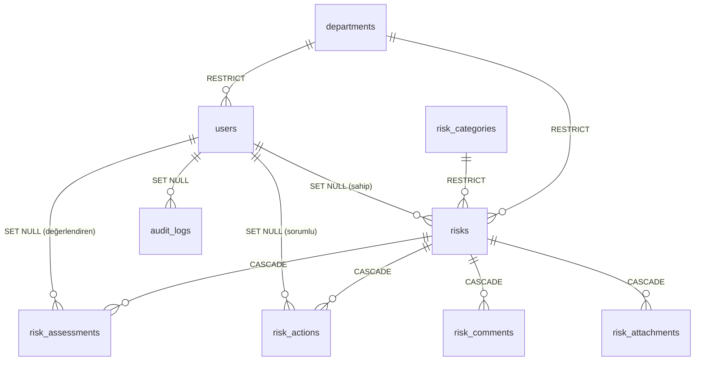

<p align="center">
  
</p>

<p align="center">
  <strong>Kurumsal risk envanteri · 5×5 değerlendirme · aksiyon takibi · yönetim raporlaması</strong>
</p>

<!-- Rozetler docs/assets/badge/ altinda, depoda. Tek dis kaynak
     asagidaki CI durumu: o gercekten dinamik olmak zorunda ve
     GitHub'in kendi ucundan geliyor. Uzerinde "CDN yok" yazan bir
     rozetin bir CDN'den gelmesi tuhaf olurdu. Ureteci:
     docs/assets/generate.py -->
<p align="center">
  <a href="https://github.com/CodeByPinar/riskops/actions/workflows/ci.yml">
    </a>
  
  
  
  
</p>

<p align="center">
  
  
  
  
  
  
  
</p>

<p align="center">
  <a href="#riskops-nedir"></a>
  <a href="#ne-degildir"></a>
  <a href="#ekran-görüntüleri"></a>
  <a href="#öne-çıkan-özellikler"></a>
  <a href="#güvenlik-yaklaşımı"></a>
  <a href="#mimari"></a>
  <a href="#hızlı-başlangıç-docker"></a>
  <a href="#mimari-kararlar-adr"></a>
  <a href="#hata-ayıklama-kipi"></a>
  <a href="#testler-ve-ci"></a>
  <a href="#yol-haritası"></a>
</p>

---

## RiskOps nedir?

RiskOps, bir kurumun **BT ve siber güvenlik risklerini** kayıt altına almak,
olasılık × etki üzerinden puanlamak, azaltıcı aksiyonları takip etmek ve
yönetime sunulabilir belgeler üretmek için yazılmış bir web uygulamasıdır.

Risk yaşam döngüsünün tamamını kapsar:

<p align="center">
  
</p>

<a id="ne-degildir"></a>

## RiskOps ne DEĞİLDİR

Bu ayrım projenin en önemli tasarım kararıdır, bu yüzden başta duruyor:

| Değildir | Neden önemli |
|---|---|
| Helpdesk / ticket sistemi | Burada "kapatılacak talep" yok; **süregiden bir risk durumu** var |
| ITSM aracı | Varlık envanteri, değişiklik yönetimi, SLA takibi kapsam dışı |
| Zafiyet tarayıcı | Tarama yapmaz; tarama **sonuçlarının yönetildiği** yerdir |
| SIEM | Log toplamaz, korelasyon kurmaz |

Bir risk çözülmez, **seviyesi düşürülür**. Veri modeli bu farkın üzerine kurulu:
bir riskin birden fazla `risk_assessment` kaydı vardır ve geçmiş değerlendirmeler
silinmez — böylece "bu risk 6 ayda nereden nereye geldi" sorusu cevaplanabilir.

---

## Ekran görüntüleri

| Panel | Risk Kaydı |
|---|---|
|  |  |

| 5×5 Risk Matrisi | Yönetici Özeti (yazdırma) |
|---|---|
|  |  |

| Hata Ayıklama Kipi | Hata Ayıklama Yönetimi |
|---|---|
|  |  |

| Eklenti Yönetimi | |
|---|---|
|  | |

Araç çubuğu her sorguyu, süresini ve o sorguyu açan dosya:satır bilgisini
gösterir. Menüden süreli olarak açılır, süre dolunca kendiliğinden kapanır.
Ayrıntı: [Hata ayıklama kipi](#hata-ayıklama-kipi).

---

## Öne çıkan özellikler

**Risk yönetimi**
- Otomatik risk kodu (`RISK-2026-0001`) — yarış koşuluna dayanıklı sıra üreteci
- 5×5 olasılık/etki matrisi, sunucu tarafında üretilir (JavaScript kapalıyken de çalışır)
- Skor `GENERATED ALWAYS AS (likelihood * impact) STORED` — veritabanı seviyesinde
- Seviye eşikleri **ayarlardan** yönetilir; eşik değişince tüm kayıtlar yeniden etiketlenir
- 10 filtre + 12 sıralanabilir kolon, FULLTEXT arama
- Yumuşak silme (soft delete) — kayıt kaybolmaz

**Aksiyon takibi**
- Riske bağlı azaltıcı aksiyonlar, sorumlu ve termin tarihi
- Geciken aksiyonlar panelde ve raporda ayrıca işaretlenir

**Raporlama**
- 6 hazır rapor + tek sayfalık **Yönetici Risk Özeti**
- Antetli, gizlilik ibareli, imza bloklu **yazdırma çıktısı** (A4, `@page`)
- Çift formatlı CSV: `excel` (Türkçe Excel'de çift tıkla açılır) ve `raw` (RFC 4180)

**İşbirliği**
- Risk kayıtlarına yorum; yazan kişi silinse bile yorum kalır
- Dosya eki: içerik tipi uzantıyla karşılaştırılır, diskteki ad uygulama
  tarafından üretilir, her ek zorla indirilir (tarayıcıda render edilmez)
- Toplu işlem: seçili risklere sahip atama, durum değiştirme, kapatma

**Yönetim**
- 4 rol × yetki matrisi (`admin` / `manager` / `analyst` / `viewer`)
- Departman ve risk kategorisi yönetimi
- Değiştirilemez (append-only) denetim kaydı
- Kullanıcı profil sayfası (rol ve departman salt okunur)
- Silinen riskleri listeleme ve geri alma
- Termini yaklaşan aksiyonlar için günlük e-posta özeti (cron)

**Genişletilebilirlik**
- **Eklenti sistemi** — çekirdeği çatallamadan menüye giriş, kuruma özel
  rapor ve risk olaylarına tepki eklenebiliyor
- Kancalar: `risk.created`, `risk.updated`, `risk.deleted`, `nav.items`,
  `reports.definitions`
- Bozuk bir eklenti uygulamayı düşürmüyor; hata yakalanıp yönetim
  ekranında gösteriliyor
- Eklenti **web arayüzünden yüklenemez** — ekran yalnızca diskte var
  olanı açıp kapatır (bkz. ADR-0010)

**Geliştirme ve teşhis**
- **Hata ayıklama kipi** — menüden süreli olarak açılır (1/4/24 saat),
  süre dolunca kendiliğinden kapanır; açma/kapama denetim kaydına yazılır
- Araç çubuğu: çalışan her SQL ve süresi, bağlanan parametreler,
  **sorguyu açan dosya:satır**, yinelenen sorgu (N+1) uyarısı, zaman
  çizelgesi, istek ve oturum içeriği
- Yığın izli, kaynak parçalı ayrıntılı istisna sayfası
- Parola, CSRF jetonu, oturum kimliği ve veritabanı parolası maskelenir —
  maskeleme testle doğrulanır
- Tek komutluk sistem teşhis raporu (`tools/debug_report.php`)

---

## Güvenlik yaklaşımı

Projeyi yazarken baştan koyduğum kurallar — hiçbirinden taviz verilmedi:

> Asla: düz metin parola · SQL string birleştirme · kaçışsız çıktı ·
> yalnızca arayüzde rol kontrolü · CSRF'siz POST · GET ile silme

Uygulanan önlemler:

| Konu | Uygulama |
|---|---|
| Parola | `password_hash()` / `password_verify()`, giriş anında `password_needs_rehash` kontrolü |
| SQL enjeksiyonu | Tüm sorgular PDO prepared statement; `ATTR_EMULATE_PREPARES = false` |
| XSS | Çıktıların tamamı `e()` (htmlspecialchars) üzerinden |
| CSRF | Oturum token'ı + `hash_equals()`, her POST'ta zorunlu |
| Oturum sabitleme | Giriş ve parola değişiminde `session_regenerate_id(true)` |
| Yetkilendirme | `require_can()` / `require_role()` — **her sayfanın başında, sunucuda** |
| Kaba kuvvet | `login_attempts` tablosu, e-posta ve IP için ayrı sayaçlar |
| Kullanıcı sayımı | Sabit maliyetli sahte hash ile zamanlama farkı eşitlenir |
| Oturum geçersizleştirme | `auth_revalidate()` her istekte rol/durum/parola damgasını doğrular |
| Sıralama enjeksiyonu | `ORDER BY` yalnızca beyaz listeden |
| `LIKE` kaçışı | `addcslashes($q, '\\%_')` |
| CSV formül enjeksiyonu | `= + - @` ile başlayan hücreler tek tırnakla metne zorlanır |
| Açık yönlendirme | Giriş sonrası `redirect` hedefi katı regex'ten geçer |
| Dizin koruması | `.htaccess` **ve** VirtualHost — `AllowOverride` kapatılsa da geçerli |
| Başlıklar | CSP, X-Frame-Options, X-Content-Type-Options, Referrer-Policy, Permissions-Policy — Apache **ve** PHP tarafında |
| Dosya yükleme | Uzantı beyaz listesi + `finfo` ile gerçek içerik doğrulaması; diskteki ad uygulama üretir |
| Ek indirme | Her zaman `application/octet-stream` + `attachment` + `nosniff` — hiçbir ek tarayıcıda render edilmez |

**Bilinen sınır:** `script-src` artık `'self'` — satır içi betik yok.
Ancak `style-src` hâlâ `'unsafe-inline'` içeriyor: uygulama dinamik ölçü
taşıyan `style=""` öznitelikleri kullanıyor (ilerleme çubuğu genişliği
gibi) ve bunlar statik sınıfa çevrilemez. XSS yükü betik enjekte eder,
stil değil; asıl kazanç `script-src` tarafındaydı. Gerekçe
`deploy/riskops.conf` içinde yorum olarak yazılıdır.

---

## Mimari

Framework yok. Her şey açıkça görünür olsun diye bilinçli bir tercih.

```
istek
  │
  └─ <sayfa>.php
       └─ includes/bootstrap.php        ← tek giriş noktası
            ├─ config/        ortam ayarları, hata yöneticileri
            ├─ db.php         lazy PDO singleton — db()
            ├─ settings.php   veritabanından ayarlar
            ├─ csrf.php       token üretimi/doğrulaması
            ├─ auth.php       rol matrisi, auth_revalidate()
            ├─ audit.php      denetim kaydı
            ├─ risk.php       skor, seviye, kod üreteci
            └─ ui.php         bileşen yardımcıları
       └─ iş mantığı + sorgular
       └─ layout/header.php → içerik → layout/footer.php
```

**Neden framework yok?** Bu proje aynı zamanda bir öğrenme aracı.
Composer paketlerinin arkasına saklanmak yerine oturum güvenliğini,
CSRF'yi, yetki matrisini ve sorgu katmanını elle yazmak; her kararın
*neden* öyle olduğunu görünür kılıyor. Kod, kararların gerekçesiyle
birlikte yorumlanmış durumda.

### Veri modeli

12 tablo. Oklar yabancı anahtarları, etiketler **silme davranışını**
gösteriyor — bu davranışlar amaca göre bilinçli olarak ayrışıyor:



Bağımsız duran üç tablo: `settings` (ayarlar), `login_attempts` (kilitleme
sayacı), `risk_sequences` (yıl başına risk kodu sayacı).

Dikkate değer birkaç karar:

- **`risks.inherent_score`** `GENERATED ALWAYS AS (likelihood * impact) STORED` —
  uygulama kodu bu değeri hiç hesaplamaz, tutarsızlık imkânsız.
- **Seviye (severity) bilinçli olarak generated DEĞİL** — eşikler ayarlardan
  değişebildiği için üretilmiş kolon yanlış olurdu. `risk_recalculate_severities()`
  eşik değişiminde tüm kayıtları yeniden etiketler.
- **`risk_sequences`** yarış koşulunu tek sorguyla çözer:
  `INSERT ... ON DUPLICATE KEY UPDATE last_number = LAST_INSERT_ID(last_number + 1)`
- **Yabancı anahtarlar** amaca göre ayrışır: `RESTRICT` (kullanımdaki departman
  silinemez), `CASCADE` (risk silinince değerlendirmeleri de gider),
  `SET NULL` (kullanıcı silinince kayıt sahipsiz kalır ama kaybolmaz).

Tam şema: [`database/schema.sql`](database/schema.sql)

### Ön yüz

- Bootstrap 5.3.3 + Bootstrap Icons + Chart.js 4.4.1 — **tamamı kendi sunucusunda**
- Inter değişken font, `latin` + `latin-ext` (Türkçe karakterler için)
- **Hiçbir CDN yok.** Kapalı ağda çalışan kurumlarda bu bir zorunluluktur;
  ayrıca üçüncü taraf bir sunucunun kullanıcıları izlemesini engeller.
- Renk paleti `validate_palette.js` ile renk körlüğü açısından doğrulandı;
  durum renkleri her zaman ikon + etiketle birlikte gelir, renk tek başına anlam taşımaz
- README'deki animasyonlu görseller de kendi deposunda barınıyor; dış bir
  servise (readme-typing-svg vb.) bağlanmıyor. Üreteçleri
  [`docs/assets/generate.py`](docs/assets/generate.py) içinde: matris
  renkleri skordan hesaplandığı için eşikler değişirse tek bir yer değişir.
  `prefers-reduced-motion` destekleniyor — hareket kapatıldığında animasyon
  durur, son kare gösterilir.

---

## Hızlı başlangıç (Docker)

Denemek için en kısa yol. Tek komut:

```bash
docker compose up
```

Sonra <http://localhost:8080> — giriş `demo@riskops.local` / `RiskOpsDemo2026`
(salt okunur). İlk açılışta şema kurulur ve 18 örnek risk ile 22 aksiyon
yüklenir; sonraki açılışlarda veri korunur.

Sıfırdan başlamak için:

```bash
docker compose down -v && docker compose up
```

| Dosya | İşlevi |
|---|---|
| `Dockerfile` | `php:8.3-apache` üzerine `pdo_mysql`, `headers`, `rewrite`, `expires` |
| `docker-compose.yml` | Uygulama + MariaDB 10.11, adlandırılmış hacimler |
| `docker/apache-riskops.conf` | `AllowOverride All` + hassas dizinler için ikinci koruma katmanı |
| `docker/entrypoint.sh` | Şema hazır olana kadar bekler, ilk açılışta örnek veriyi kurar |
| `docker/database.php` | Ortam değişkeninden okur — imajda gömülü parola yoktur |

> Bu compose dosyası **yerel kullanım ve tanıtım içindir**. Parolalar
> dosyada düz metin durur. İnternete açılacak bir kurulum için
> [deploy/DEPLOY.md](deploy/DEPLOY.md) yordamını izleyin.

---

## Kurulum (Docker'sız)


Ubuntu Server 24.04 · PHP 8.3 · MariaDB 10.11 · Apache 2.4

```bash
# 1. Kodu yerleştirin

[](https://github.com/CodeByPinar/riskops/actions/workflows/ci.yml)
sudo git clone https://github.com/<kullanici>/riskops.git /var/www/riskops
sudo chown -R www-data:www-data /var/www/riskops

# 2. Veritabanını oluşturun
sudo mysql -e "CREATE DATABASE riskops CHARACTER SET utf8mb4 COLLATE utf8mb4_unicode_ci;"
sudo mysql -e "CREATE USER 'riskops_user'@'localhost' IDENTIFIED BY 'GUCLU_BIR_PAROLA';"
sudo mysql -e "GRANT SELECT,INSERT,UPDATE,DELETE ON riskops.* TO 'riskops_user'@'localhost';"

# 3. Şemayı ve başlangıç verisini yükleyin
sudo mysql riskops < /var/www/riskops/database/schema.sql
sudo mysql riskops < /var/www/riskops/database/seed.sql

# 4. Yapılandırma
sudo cp /var/www/riskops/config/database.example.php /var/www/riskops/config/database.php
sudo nano /var/www/riskops/config/database.php     # 'pass' değerini girin

# 5. Apache
sudo cp /var/www/riskops/deploy/riskops.conf /etc/apache2/sites-available/
sudo a2enmod headers rewrite expires
sudo a2ensite riskops
sudo apache2ctl configtest && sudo systemctl reload apache2
```

**İlk giriş:** `admin@riskops.local` / `Admin123456` —
uygulama ilk girişte parola değiştirmeye zorlar.

### İsteğe bağlı: demo verisi

Nasıl göründüğünü hızlıca görmek için 18 gerçekçi risk, 22 aksiyon ve
3 demo kullanıcı yükler:

```bash
sudo -u www-data php /var/www/riskops/tools/seed_demo.php
```

> `tools/seed_demo.php` bir `--purge` anahtarı da kabul eder ve bu anahtar
> **tüm risk verisini siler**. Üretim sunucusunda çalıştırmayın; canlıya
> alırken `tools/` dizinini tamamen kaldırın.

<details>
<summary><b>Canlıya alma kontrolü</b></summary>


```bash
sudo -u www-data php /var/www/riskops/tools/go_live_check.php
```

Veri değiştirmeyen bir ön kontroldür: dizin izinleri, güvenlik başlıkları,
ortam değişkeni, varsayılan parola, saat dilimi hizası gibi 31 maddeyi
denetler ve eksikleri listeler.

</details>

<details>
<summary><b>İnternete açık kurulum</b></summary>


Adım adım yordam: **[deploy/DEPLOY.md](deploy/DEPLOY.md)** — VPS hazırlığı,
HTTPS, güvenlik duvarı, gece sıfırlaması ve son kontrol listesi.

Uygulamanın bir **demo kipi** vardır; ortam değişkeniyle açılır:

```apache
SetEnv RISKOPS_DEMO 1
```

Etkisi yalnızca giriş ekranındadır — ziyaretçiye deneme hesabının
bilgilerini gösterir ve o hesabın parolasını değiştirmesini engeller
(yoksa bir ziyaretçi demoyu herkese kapatabilirdi). **Yetkilendirmeye
hiçbir etkisi yoktur**: ziyaretçinin ne yapabileceğini `viewer` rolü
belirler, bu bayrak değil.

</details>

---

## Mimari kararlar (ADR)

Projede **neden öyle yapıldığı** `docs/architecture/` altında ayrı
kayıtlarda tutuluyor. Her kayıt aynı beş başlığı taşır: bağlam, karar,
sonuçlar, **kabul edilen maliyet** ve **değerlendirilen alternatifler**.

| # | Karar | Özet |
|---|---|---|
| [0001](docs/architecture/0001-cerceve-kullanilmadi.md) | Çerçeve kullanılmadı | Kurulum dosya kopyalamak; bedeli ~18.500 satırın bakımı |
| [0002](docs/architecture/0002-ceviri-anahtari-kaynak-metin.md) | Çeviri anahtarı = Türkçe metnin kendisi | Eksik çeviri sayfayı bozmaz; bedeli metin değişince çevirinin düşmesi |
| [0003](docs/architecture/0003-csp-unsafe-inline-kaldirildi.md) | CSP'den `unsafe-inline` kaldırıldı | XSS'in etkisi sınırlı; bedeli Apache'de CSP kopyası tutulamaması |
| [0004](docs/architecture/0004-saat-dilimi-hizalamasi.md) | MySQL saati PHP ile hizalanır | 3 saatlik kayma hesap kilidini sessizce devre dışı bırakıyordu |
| [0005](docs/architecture/0005-son-admin-invaryanti.md) | Son admin koruması kilitli okumayla | Check-then-act yarışı sistemi adminsiz bırakabiliyordu |
| [0006](docs/architecture/0006-seviye-esikleri-ayarda.md) | Skor `GENERATED`, seviye değil | Eşikler ayardan değişebiliyor, skorun tanımı sabit |
| [0007](docs/architecture/0007-hata-ayiklama-kipi.md) | Hata ayıklama: iki anahtar, süreli bayrak | Üretimde kazayla açılamaz, açık unutulamaz |
| [0008](docs/architecture/0008-dosya-eki-guvenligi.md) | Dosya ekleri üç katmanlı doğrulanır | Ne sunucuda çalıştırılabilir ne tarayıcıda yorumlanabilir |
| [0009](docs/architecture/0009-gelistirme-bagimliliklari.md) | Geliştirme bağımlılığı evet, çalışma zamanı hayır | PHPUnit/php-cs-fixer/PHPStan alındı; Doctrine alınmadı, gerekçesiyle |
| [0010](docs/architecture/0010-eklenti-sistemi.md) | Eklenti sistemi: kancalar var, kum havuzu yok | Web'den yükleme YOK — admin hesabı uzaktan kod çalıştırmaya dönüşmesin |
| [0011](docs/architecture/0011-sorgu-katmani.md) | İnce bir sorgu katmanı — ORM değil | SQL çağrı yerinde kalıyor; tekrarlanan prepare/execute/fetch tek yere indi |
| [0012](docs/architecture/0012-phpstan-seviye-8.md) | PHPStan seviye 8'de durulması | Seviye 9, 830 yerde is_scalar sarmalayicisi isterdi; korudugu senaryo semada zaten sabit |

Bu kayıtlar önce kaynak dosyaların başındaki uzun yorum bloklarındaydı.
İki sorun vardı: bir karar tek bir dosyaya ait değildi (CSP kararı dört
dosyaya bölünmüştü, hiçbiri bütün değildi) ve 40 satırlık gerekçenin
ardından gelen 12 satırlık fonksiyonu görmek zorlaşıyordu. Artık kod
**onu bozmadan değiştirmek için gerekeni** söylüyor, kayıt tartışmayı
taşıyor.

---

## Hata ayıklama kipi

Geliştirirken "bu sayfa neden yavaş", "bu sorgu neden boş döndü", "bu
oturumda ne var" sorularını `var_dump()` serpiştirmeden cevaplamak için
bir hata ayıklama kipi vardır.

<details>
<summary><b>Nasıl açılır</b></summary>


**Yönetim ekranından** (önerilen) — kenar çubuğunda
**Yönetim &rarr; Hata Ayıklama**. Süre seçilir (1 / 4 / 24 saat), kip
o süre için açılır ve **kendiliğinden kapanır**. Sunucuya girmek,
dosya düzenlemek veya Apache'yi yeniden başlatmak gerekmez.


**Ortam değişkeniyle** (kalıcı, sunucu yöneticisinin kararı):

```apache
SetEnv RISKOPS_DEBUG 1
```

Fark: ortamdan açılan kip yönetim ekranından kapatılamaz — o zaman
ekran bunu açıkça söyler ve kapatma düğmesini göstermez.

Açıkken sayfanın altında bir araç çubuğu belirir:

| Panel | İçerik |
|---|---|
| **Sorgular** | Çalışan her SQL, süresi, dönen satır sayısı, bağlanan parametreler ve **sorguyu açan dosya:satır**. Yavaş olanlar ve aynı SQL'in tekrarı (N+1 işareti) ayrıca işaretlenir. |
| **Zaman** | İstek süresi, süreölçerler, sayaçlar, `debug_mark()` ile bırakılan işaretler |
| **İstek** | `$_GET`, `$_POST`, `$_FILES`, `$_COOKIE`, ilgili `$_SERVER` anahtarları |
| **Oturum** | Giriş yapan kullanıcı, rolünün yetki listesi, `$_SESSION` içeriği |
| **Ortam** | APP_ENV, PHP ve MariaDB sürümü, saat dilimi, bellek sınırı, yüklenen dosya sayısı |
| **Notlar** | `dbg()` dökümleri ve `debug_note()` notları |
| **Log** | `storage/logs/app.log` kuyruğu |

Kod içinden kullanılan yardımcılar — hepsi kip kapalıyken ilk satırında
döner, yani üretimde unutulmuş bir çağrı hiçbir şey yapmaz:

```php
dbg($risk, 'store öncesi');          // değeri araç çubuğuna bas
debug_mark('rapor sorgusu bitti');   // zaman çizelgesine nokta koy
debug_timer_start('csv'); …; debug_timer_stop('csv');
debug_note('mail', 'gönderim atlandı', ['sebep' => 'adres yok']);
```

Ayrıca:

- **Ayrıntılı istisna sayfası** — yığın izi, hatalı satırın kaynak
  parçası ve o isteğe kadar çalışmış tüm sorgular. Bozuk bir SQL'in
  kendisi de listede ve kırmızı görünür.
- **`X-RiskOps-Debug` yanıt başlığı** — süre, bellek ve sorgu sayısı.
  CSV dışa aktarma ve yönlendirme gibi araç çubuğu basılamayan
  yanıtlarda ölçüm buradan okunur.
- **`storage/logs/debug.log`** — istek başına tek satır özet. Yalnızca
  sorunlu istekler istenirse `SetEnv RISKOPS_DEBUG_LOG_ONLY_SLOW 1`.
- **Araç çubuğundaki "Kipi kapat"** — kipi gerçekten kapatır
  (POST + CSRF). Yanındaki `✕` yalnızca gizler, kip açık kalır.
- **`?rkdebug=off`** — araç çubuğunu bu oturum için gizler (ekran
  görüntüsü alırken), kipi kapatmaz.

</details>

<details>
<summary><b>Açık unutulamaz</b></summary>


Yönetim ekranından açılan kip bir **bitiş zamanı** taşır
(`storage/debug.flag`). Süre dolduğunda dosya silinmemiş olsa bile
yok sayılır — "geçen ay açmıştım, hâlâ açıkmış" durumu oluşamaz.

</details>

<details>
<summary><b>Üretimde kazayla açılamaz</b></summary>


Ortam değişkeni yolunda: `APP_ENV=production` iken `RISKOPS_DEBUG`
**tek başına yetmez**, ayrıca `RISKOPS_DEBUG_PRODUCTION=1` gerekir.
Kopyalanmış bir VirtualHost'ta unutulan tek bir satır canlı sistemi
bilgi sızdıran hâle getirmesin diye böyle.

Yönetim ekranı yolunda bu çifte bayrak aranmaz ve bu kasıtlıdır:
oradaki açma zaten **kazara değildir** — oturum açmış bir admin,
POST + CSRF ile, süreli olarak yapar ve işlem denetim kaydına yazılır
(`debug.enable` / `debug.disable`). Çifte bayrak kuralı unutulmaya
karşıdır, bilinçli açmaya karşı değil.

Hangi yoldan açılırsa açılsın araç çubuğu üretimde yalnızca `admin`
rolüne gösterilir, `tools/go_live_check.php` durumu `FAIL` olarak
raporlar ve nasıl kapatılacağını kaynağına göre söyler.

</details>

<details>
<summary><b>Sır basmaz</b></summary>


Araç çubuğu istek ve oturum içeriğini gösterdiği için maskeleme
zorunludur. İki katman çalışır: anahtar adı şüpheliyse (`password`,
`_csrf`, `PHPSESSID`, `api_key`…) değer `***` olur; anahtar masum olsa
bile **değerin kendisi** veritabanı parolası, oturum kimliği veya CSRF
jetonuyla aynıysa yine `***` olur.

```bash
php tools/debug_test.php                  # kip kapalıyken:  109/109
RISKOPS_DEBUG=1 php tools/debug_test.php  # kip açıkken:     119/119
```

</details>

<details>
<summary><b>Teşhis raporu</b></summary>


Hata bildirirken ortamı tarif etmek yerine:

```bash
php tools/debug_report.php > rapor.txt
```

PHP sürümü ve eklentileri, MariaDB sürümü ve oturum değişkenleri,
tablo satır sayıları ve boyutları, dizin izinleri, PHP–MySQL saat
farkı, disk durumu ve log kuyruğu. Bağlantı bilgisi ve parola çıktıya
girmez; raporu olduğu gibi paylaşabilirsiniz.

</details>

---

## Testler ve CI

Her itmede GitHub Actions dört iş çalıştırır:

| İş | Ne yapar |
|---|---|
| **Sözdizimi** | PHP 8.2 / 8.3 / 8.4 üzerinde `php -l`, tüm dosyalar |
| **Birim testleri** | PHPUnit, **veritabanısız**, üç PHP sürümünde |
| **Entegrasyon** | MariaDB 10.11 ve 11.4; şema SIFIRDAN yüklenir, sonra bir kez daha (yeniden çalıştırılabilirlik), ardından tüm test betikleri |
| **Kod kalitesi** | php-cs-fixer (biçim), PHPStan seviye 8, `tools/check_conventions.php`, sürüm kontrolüne sır girmemiş mi |

### Test yapısı

```
tests/
  bootstrap-unit.php     veritabanı GEREKTİRMEZ
  bootstrap-app.php      gerçek bootstrap + veritabanı
  Unit/                  saf mantık      (116 test)
  Integration/           şema ve sayaçlar (12 test)
```

```bash
composer test:unit           # veritabanı gerekmez
composer test:integration    # config/database.php gerekir
composer test                # ikisi

composer cs                  # kod biçimi: yalnızca rapor
composer cs:fix              # kod biçimi: düzelt
composer stan                # statik çözümleme
composer quality             # kurallar + biçim + statik çözümleme
```

Üçü de **geliştirme** bağımlılığı: uygulamayı çalıştırmak için
`vendor/` dizini gerekmiyor, çalışma zamanı bağımlılığı hâlâ sıfır.

İki ayrı ön yükleyici olmasının sebebi: uygulamanın kendi bootstrap'ı
açılışta ayar tablosunu okur, yani her zaman veritabanına gider. Dil
devri kuralını ya da maskelemeyi sınamak için MariaDB kurmak zorunda
kalmak, katkı vermenin önünde gereksiz bir engel olurdu. Birim
ön yükleyicisinde `db()` bilerek bir istisna fırlatır — bir birim testi
yanlışlıkla veritabanına uzanırsa sessizce beklemek yerine nereye ait
olduğunu söyler.

<details>
<summary><b>Betik testleri</b></summary>


PHPUnit'e taşınmayan, uçtan uca çalışan denetimler:

```bash
php tools/smoke_test.php           # 59 doğrulama
php tools/debug_test.php           # 109 (kip kapalı) / 119 (açık)
php tools/check_conventions.php    # 7 proje kuralı
php tools/last_admin_race_test.php # eşzamanlılık
php tools/go_live_check.php        # üretime alma ön kontrolü
php tools/debug_report.php         # sistem teşhis raporu
```

</details>

<details>
<summary><b>Denetlenen proje kuralları</b></summary>


`tools/check_conventions.php` dosyaları token'larına ayırarak inceler —
grep değil, çünkü kuralı **anlatan** yorum satırları kuralın ihlali
sanılıyordu:

- SQL'e doğrudan kullanıcı girdisi birleştirilmemiş
- Satır içi `<script>` yok (CSP: `script-src 'self'`)
- `style=""` özniteliği yok (nonce yalnızca blokları kapsar)
- Silme işlemine GET bağlantısı yok
- POST işleyen her uç `csrf_require()` çağırıyor
- Üretim kodunda unutulmuş `var_dump` / `print_r` yok
- Her dosya `declare(strict_types=1)` ile başlıyor

</details>

---

## Proje büyüklüğü

| | |
|---|---|
| PHP dosyası | 120 uygulama + 11 test |
| PHP satırı | ~19.570 uygulama + ~1.440 test |
| CSS satırı | ~2.510 (`app.css`) + araç çubuğu ve yazdırma stili |
| Veritabanı tablosu | 14 |
| PHPUnit | 159 birim + 12 entegrasyon |
| Betik testleri | 59 duman + 109/119 hata ayıklama + 7 kural |
| Mimari kaydı (ADR) | 10 kayıt |
| Statik çözümleme | PHPStan seviye 8, temel çizgi (baseline) yok |
| Çalışma zamanı bağımlılığı | **0** (PHPUnit yalnızca `require-dev`) |

---

## Yol haritası

Önceki yol haritasındaki altı maddenin tamamı tamamlandı:

- [x] CSP'den `script-src 'unsafe-inline'` kaldırıldı
- [x] Risk kayıtlarına yorum ve dosya eki
- [x] Termin yaklaşan aksiyonlar için e-posta bildirimi
- [x] Toplu işlemler (çoklu risk atama / durum değiştirme / kapatma)
- [x] Kullanıcı profil sayfası
- [x] Silinen riski geri alma ekranı

Sırada:

- [x] `style-src 'unsafe-inline'` kaldırıldı — satır içi stil özniteliği
      kalmadı; dinamik renkler nonce taşıyan bir `<style>` bloğunda
- [x] Aksiyonlar için de yorum ve ek (ortak tartışma katmanı)
- [x] Risk değerlendirme hatırlatması (uzun süre gözden geçirilmeyen kayıtlar)
- [x] Dışa aktarılabilir denetim raporu (audit log filtreli CSV)
- [~] Çok dilli arayüz — **altyapı tamam, çeviri kısmi** (aşağıya bakın)

Sonradan eklenenler:

- [x] Arayüz yenilendi — giriş ekranının açık, ferah dili uygulama
      geneline taşındı
- [x] **Hata ayıklama kipi** — sorgu kaydedici, araç çubuğu, ayrıntılı
      istisna sayfası, teşhis raporu; menüden süreli açılıp kapanıyor
- [x] GitHub Actions CI — sözdizimi, birim + entegrasyon testleri,
      sıfırdan şema kurulumu, proje kuralları
- [x] PHPUnit test yapısı (veritabanılı ve veritabanısız iki takım)
- [x] Mimari karar kayıtları (`docs/architecture/`)

Sırada:

- [x] Statik çözümleyici — PHPStan seviye 5, ilk koşusunda gerçek bir
      hata buldu (`due_date_cell` sessizce düşen argüman)
- [x] php-cs-fixer — kod biçimi PSR-12
- [x] Eklenti sistemi — kancalar, yönetim ekranı, örnek eklenti
- [x] PHPStan seviye 6 → 7 → 8 — her seviye kendi commit'inde, kendi
      düzeltmeleriyle, baseline'sız. Seviye 9 açılmadı (ADR-0012)
- [x] İnce bir **sorgu katmanı** — ORM değil: `prepare/execute/fetch`
      üçlüsü tek yere indi, SQL çağrı yerinde kaldı (ADR-0011)
- [x] Kalan ekranların çevirisi — tüm ekranlar İngilizce; sözlük
      tutarlılığı `tools/i18n_check.php` ile CI'da denetleniyor

### Çok dilli arayüz: durum

Altyapı çalışır durumda ve test edilmiştir: `t()` / `te()` fonksiyonları,
`lang/tr.php` + `lang/en.php` sözlükleri, kullanıcı başına kalıcı dil
tercihi (`users.locale`), kenar çubuğunda dil değiştirici.

**Çeviri anahtarı Türkçe metnin kendisidir** (`t('Yeni Risk')`). Bunun
pratik sonucu: sözlükte karşılığı olmayan bir metin bozulmaz, doğru
Türkçesiyle görünür. Yani kısmi çeviri kullanılabilir bir durumdur,
kırık bir durum değil.

Tüm ekranlar çevrilmiştir. Sözlükte **326 kayıt** var; `t()`/`te()`
ile sarılmış 311 anahtarın tamamının karşılığı mevcut
(`php tools/i18n_check.php` ile doğrulanır, CI'da da koşar).

| Çevrildi | Kapsam dışı |
|---|---|
| Panel, risk listesi/formu/detayı | Yardım metinlerinin uzun paragrafları |
| Aksiyonlar, değerlendirmeler | `tools/` altındaki operatör betikleri |
| Raporlar ve yönetici özeti | Hata ayıklama araç çubuğu |
| Yönetim ekranlarının tamamı | Denetim kaydındaki veri değerleri |
| Denetim kaydı, eklentiler | |
| Giriş, profil, yorumlar, ekler | |

**Uzun yardım paragrafları neden kapsam dışı:** bunlar `<strong>` ve
`<?= ?>` parçalarıyla bölünmüş cümlelerdir. Parça parça çevirmek —
"Inherent (", ") × Etki" gibi — kelime sırası dillere göre değiştiği
için bozuk İngilizce üretir. Yarım çevrilmiş bir cümle, hiç
çevrilmemiş olandan kötüdür; bu yüzden Türkçe bırakıldılar.

**Sarma işi elle yapılmadı:** metin düğümlerini `te()` ile saran bir
araç yazıldı. Kuralı dar tutuldu — bir metin ancak bir elemanın
**tamamı** ise sarılıyor (öncesi açılış etiketi, sonrası kapanış
etiketi). İlk sürüm bu kural olmadan cümle parçalarını da yakalamıştı.

**Bilinen sınır:** aynı Türkçe kelime farklı bağlamlarda farklı
çevrilmesi gerektiğinde tek anahtar yetmez. Giriş ekranındaki
"Daha Güvenli" bunun örneği: hem başlıkta hem rozette geçiyor, iki
farklı İngilizce karşılığı var. Çözüm, o metinleri tam ifade olarak
anahtarlamak (`'Daha Güvenli Operasyonlar'`).

---

## Lisans

MIT — bkz. [LICENSE](LICENSE).

---

<details>
<summary><strong>In English</strong></summary>

**RiskOps** is an IT & cyber security risk management platform: risk register,
5×5 likelihood/impact assessment, mitigation action tracking, and printable
executive reporting.

It is deliberately **not** a helpdesk, ITSM tool, vulnerability scanner, or SIEM.
A risk isn't "closed" like a ticket — it's reassessed, and its level goes down.
The data model reflects that: every risk owns a history of assessments that is
never deleted.

Built with PHP 8.3, MariaDB 10.11 and Apache — **no framework, no Composer
dependencies, no CDN** (all assets self-hosted, which matters for air-gapped
corporate networks). Security was a first-class constraint rather than a
later pass: prepared statements with emulation disabled, CSRF on every POST,
server-side authorisation on every page, per-request session revalidation,
rate limiting with timing-equalised login, and CSV formula-injection escaping.

The UI and all documentation are in Turkish.

</details>
